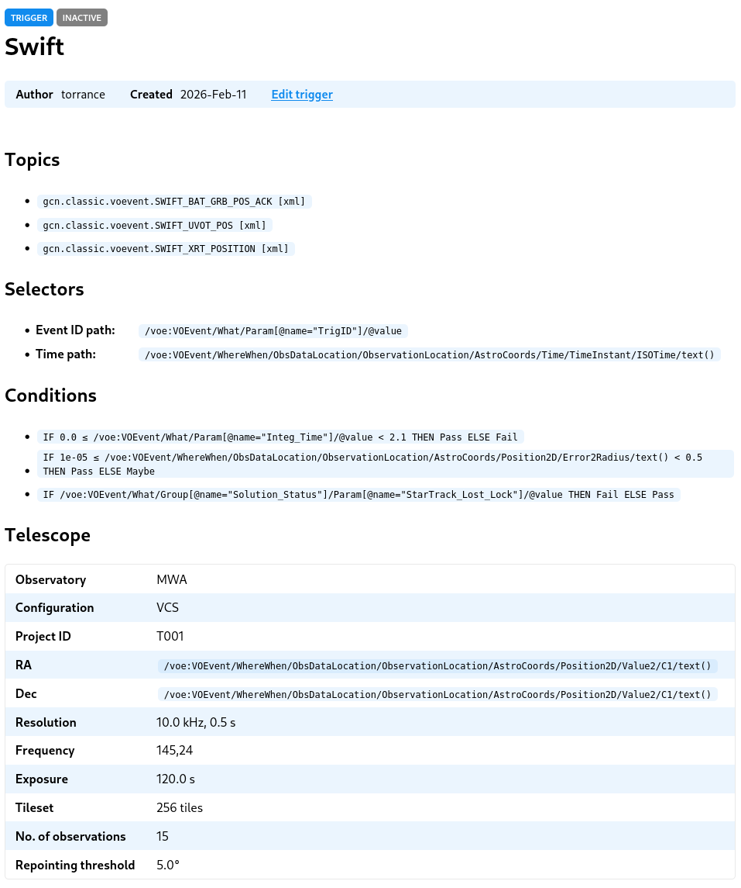
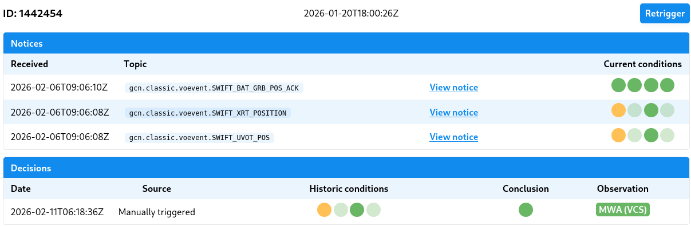
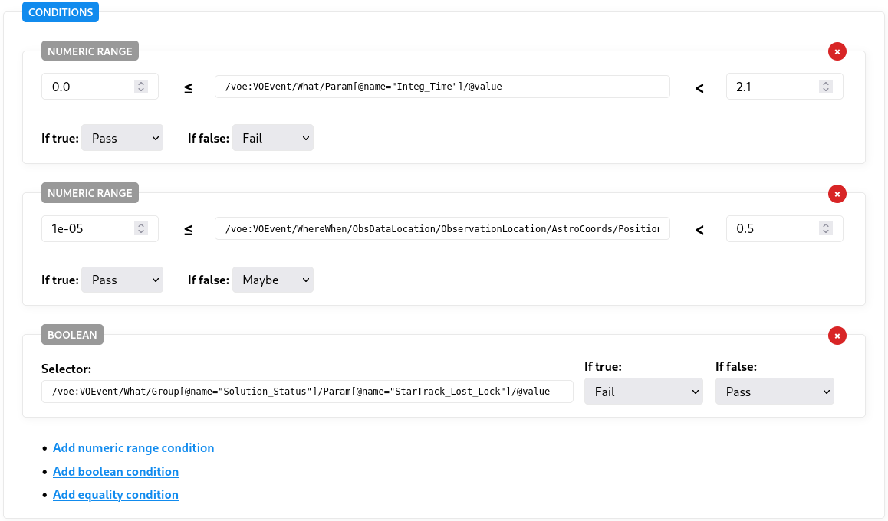
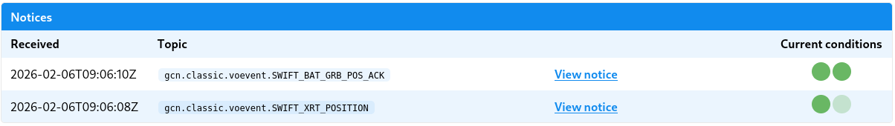
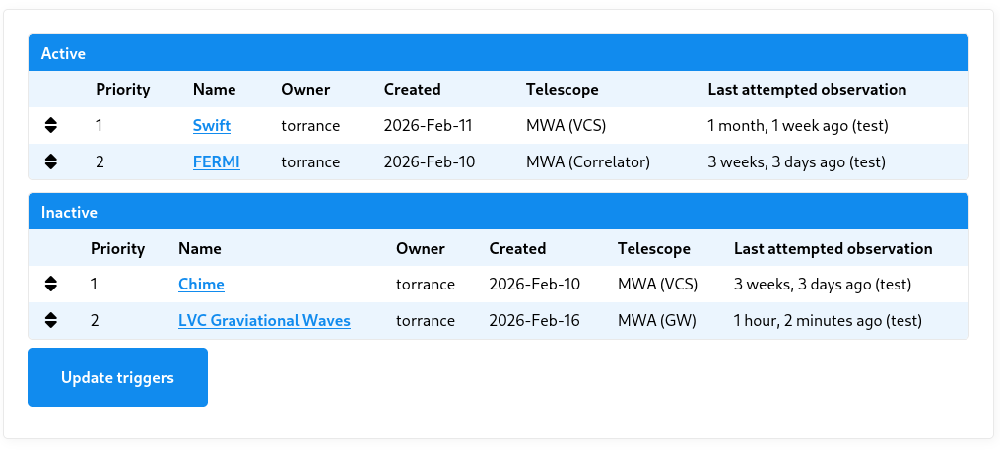

# TRACE-T Documentation

This documentation describes TRACE-T, or Transient RApid-response using Coordinated Event Triggering. TRACE-T is a web application that listens for notices from upstream, early detection instruments and automates the triggering of downstream observatories.

For quick, hands-on introduction, check out the [tutorial](tutorial.html).

1. Contents
{:toc}

## Overview

### Chain of events

Internally, TRACE-T handles transient notices using the following chain of events:

1. A new notice is received by TRACE-T.
2. Each _active_ ruleset, known as a [_trigger_](#triggers), is offered the chance to react to the notice _in order of priority_.
3. If a trigger subscribes to the notice's associated topic **and** the trigger's set of conditions all `PASS` (possibly using [condition inheritance](#Condition-inheritance)), **then** the trigger will attempt to make an observation.

There are a few complicating factors to be aware of:

* If a TRACE-T observation is already underway, that observation can only be overridden by a Trigger having a higher priority.
* If the same Trigger has itself already started an observation, that observation may be overridden if (based on new information) the new source coordinates deviate more than the repointing threshold.

It is also possible to manually _retrigger_ a specific event attached to a trigger, and special rules around condition evaluation apply in this case. See [the discussion](#conditions) of condition evaluation for more details.

## Notices

Notices are broadcast by Nasa's [General Coordinates Network](https://gcn.nasa.gov/) (GCN) and are sorted by <em>topics.</em>

Each topic pertains to a particular upstream early-detection instrument and will broadcast notices using a fix payload format. TRACE-T is compatible with XML and JSON formats.

TRACE-T has a background service that listens for the configured set of topics and records any new notices that are broadcast.

> **Hint:** The status of the GCN Listen background service is reported at the top right of all pages (e.g. "Stream OK" ). This status depends on TRACE-T having recorded a "heartbeat" notice no older than at most 5 seconds.

In addition to their payload, notices have both a `created` and `received` time. The `created` time records the time reported by the Kafka message broker, whilst `received` is the time TRACE-T downloads and saves the notice. Ideally, the time delay between a notice being created and received should be on the order of seconds.

### Viewing notices

Notices can be viewed at `/notices`, and it is possible to further filter this list by topic, format and date range.

Individual notices can be viewed and this will display the full data payload, being either XML or JSON.

> **Hint:** When configuring a new trigger, open up several example notices to help understand the structure of the payload and aid in writing the necessary XPath or JSONPath queries.

## Triggers

Triggers combine three things:

* They subscribe to a subset of available topics
* They list a set of user-configurable conditions about the event that must be satisfied
* They specify observing parameters for the downstream observatory

### Viewing a trigger

A full list of existing triggers is available at `/triggers`. This summary screen shows, at a glance, which triggers are active and inactive, as well as their respective priorities.

> **Note:** In TRACE-T, lower numbers indicate a higher priority. For example, a trigger with priority `1` will be evaluated before one with a priroity of `5`.

For any trigger, you can click through to view a detailed overview that describes the three elements that define the trigger: the list of subscribed topics (and their associated selectors); the conditions; and the downstream observing configuration.

For example:



Beneath this is a paginated view of events. Events are generated by the combination of the topic subscriptions and the Event IDs that are extracted from their associated notices.

Consider an example of one of these events:



* The ID displays the group ID that unifies this set of notices as pertaining to the same underlying event.
* The uppermost date shows the time of the event (this value is calculated as the earliest time found at the time path among the event's notice set).
* The Notices table displays the notices associated with the event, in the order they were received
* Current conditions shows how the _present_ trigger conditions would be evaluated at the time the notice was received. This is a hypothetical evaluation that is used as part of testing a trigger—it lets us quickly identify whether our current configuration makes sense given the historic archive of notices. The current conditions will be updated every time the trigger configuration is changed. Hovering over each traffic light will identify each condition.
* The Decisions table shows historic decisions:
   * Each decision has a source which indicates what event led to an decision being made. This will typically be a new notice being received but may also be a due to manually retriggering the event.
   * The historic conditions displays which conditions were evaluated at the time of the decision and their outcomes. Hovering over each traffic light will provide further information about the condition.
   * The conclusion shows the summary outcome of the conditions.
   * The observation field shows the outcome of any observation request, if one exists, and one can click through to a detailed log of this request.

### Creating a trigger

Start by going to `/triggers/create` to create a new trigger.

> **Hint:** You will need to understand how to use [XPath or JSONPath](#XPath-and-JSONPath) queries to extract information from the incoming notices. And you might also want to load up a number of example notices to help with understanding the notice payload structure.

#### Selecting topics

First select each topic that you wish your trigger to subscribe to. You can select multiple triggers by holding down Ctrl/Command.

There are number of constraints that must be observed when selecting multiple topics:

* Each topic must be of the same format (XML or JSON).
* Each topic must use the same Event ID, and this must be located at the same path within the notice payload (which is usually the case for notices originating from the same upstream instrument)
* Similarly, the path to the event time must be shared amongst all notices.

If you are subscribing to a set of notices from a single observatory, these contraints will normally be satisfied.

#### Event ID path

The event ID is label assigned by an upstream observatory to an astronomical event. The event ID provides a unifying reference that is essential in the case where multiple notices are issued.

This field requires you to provide the XPath or JSONPath to the event ID element within each notice.

#### Time path

Notices contain a timestamp that references the underlying event and is separate to (and precedes) the notice creation time.

TRACE-T will set the overall event timestamp as the earliest time (referenced by this given XPath or JSONPath element) amongst all event notices.

#### Expiry

There is only a limited time window after an event has occurred where follow up observations are useful, although this window differs based on the astronomical event itself and downstream observatory configuration.

This field, measured in minutes, sets this window of interest. This field adds a condition that returns `PASS` when evaluated within the window, or if exceeded returns `MAYBE`.

Notices that arrive outside of this window will never trigger a new observation even if all other conditions are satisfied. On the other hand, if an event is manually retriggered, the `MAYBE` will be promoted to `PASS` as per the standard condition rules.

#### Conditions

Frequently one wants to perform follow-up observations on only a subset of events. Conditions are built to query various parameters of the event and ensure downstream observations are triggered only on this desired subset.

Each condition will inspect the set of event notices, and depending on the configuration, return a `PASS`, `MAYBE` or `FAIL` vote.

Condition votes are tallied into a conclusion using the following rules:

* If _all_ conditions return `PASS` then the conclusion is `PASS`. This is also the default behaviour when there are no conditions at all.
* If _any_ condition is `FAIL`, then the conclusion is `FAIL`
* A `MAYBE` vote is designed to allow for triggering on edge cases _only after_ human inspection. `MAYBE` changes depending on whether the decision was triggered automatically or manually:
   * When a decision is triggered by an incoming notice (i.e. automatically), a `MAYBE` will be demoted to `FAIL`
   * When a decision is manually re-triggered, a `MAYBE` will be promoted to `PASS`

It is also possible that a condition may not evaluate. This can occur, for example, if a condition depends upon a property that is absent from the notices. Unevaluated conditions will cause the conclusion to `FAIL`, however see the next section on [condition inheritance](#Condition-inheritance).

There are at present three possible types of conditions:

**Numeric range:** Tests whether a numeric value falls within some range. The XPath/JSONPath selector must point to either to a numeric value or a string value that can be parsed as a number by Python's `float()` function.

**Boolean condition:** Tests whether a boolean value is true. The selector must point to a boolean type (available in JSON) or else the following following rules apply: if the value is a number then 0 will evaluate to false and all other values will evaluate to true; if a string, "yes" and "no", as well as "true" and "false", will evaluate to their respective boolean values.

**Equality:** Tests whether a value is equal to one or more candidates. The equality test is based on string equality and all values will be first converted to their string representation (using Python's `str()` function). Multiple candidates can be specified, one per line, and if the string equality holds against any one of these, the condition will evalute as true.

You may add as many conditions as are needed, as shown in the following example:



#### Condition inheritance

It is common for an astronomical event to trigger multiple notices, for example by being generated by different instruments on board an orbiting observatory. As a result, any one notice typically contains only a subset of the total event description.

To account for this, TRACE-T conditions work based on an inheritance model. Condition inheritance allows us to "accumulate" knowledge about an event, in chronological order, from multiple event notices.

An example might help:

> **Example:** Swift generates multiple notices per event. One important condition checks for starlock failure. This information is usually in the first notice as a kind of initial system diagnostic, but it is not present in subsequent notices. TRACE-T will mark the condition as passed (or failed) from this first notice, but in subsequent notices it will simply inherit this status _unless the information is provided again in a subsequent notice._

On each trigger's listing of events, you will observe the condition results being symbolised by the traffic light icon, but you may also observe some results being washed out. These washed out results indicate that the condition result has been inherited:



## Administration

Site administration actions can be performed by any user that has both of the following attributes:

1. They are a member of the `admin` group
2. They have the `Staff` attribute selected (required to access any `/admin` page)

### Trigger management

There are two restricted properties of a trigger that can only be modified by an administrator. They are:

* Changing a trigger's active/inactive status
* Changing the weight of a trigger

To modify both of these properties go to `/triggers`. You will see a screen similar to:



* Change a trigger's weight by dragging the trigger's toggle to reorder the a trigger with respect to other triggers.
* Set a trigger as (in)active by dragging the trigger's toggle _between_ each of the Active or Inactive tables.

Then save your changes by clicking "Update triggers".

### User management

#### Creating and modifying a new user

Go to `/admin/auth/user` to a list of system users.

To create a user, click "add user" and enter a new username and password. If this account is being created for someone else, it is advisable not to share the password but rather ask the user to reset their password using the "Forgot my password" functionality.

After creating a new user, you will be redirected to a full user edit screen. Ensure you set:

* Full name
* Email address (essential for password reset)
* Add them to the `astronomers` group if you to allow them to create triggers

> **Warning:** Deleting a user will also delete their associated triggers.

#### Controlling user permissions

At present there are two user groups:

* `astronomer` allows one to create new triggers and edit owned triggers
* `admin` allows one to create and edit any existing triggers, as well as administer trigger status and priority

A user can be asigned groups from within their respective user edit form.

> **Note:** To access pages at `/admin`, a user must be assigned as `staff`, which can be enabled on the user edit form. To perform backend admin tasks, a user must be _both_ `staff` and a member of `admin`.

### GCN Topic management

TRACE-T can subscribe (and unsubscribe) to GCN topics. Once subscribed to a topic, TRACE-T will begin listening and storing new notices on that topic.

#### Viewing existing topics

You can an overview existing GCN topics at `/admin/tracet/gcnstream`.

This page provides statistics for each topic including:

* the total number of stored notices
* the estimated filesize of the cumulative payloads

Additionally, the `status` field indicates any errors with a topic. When a new topic is added, this field will initialise to `—` and will change to `OK` upon successfully receiving its first message. If an error occurs, this will also be reported in the status field.

#### Adding a new topic

> **Warning:** Once a topic is subscribed to, future notices will begin being saved by TRACE-T. To ensure disk space is not exhausted, be cautious of subscribing to topics that are extremely chatty or topics where notices contain embedded data sources.

To add a new topic:

1. Go to `/admin/tracet/topic` and select "Add topic".
2. Enter both the name of the topic (e.g. `gcn.classic.voevent.FERMI_GBM_FLT_POS`) and select its format (`JSON` or `XML`). Hint: To discover the available topics, proceed through the wizard at [https://gcn.nasa.gov/quickstart](https://gcn.nasa.gov/quickstart); the topic names will be available in the code snippets.

> **Note:** The background listener may take up to 10 minutes to detect topic changes.

Once added, you can view the full list of topics at `/admin/tracet/gcnstream`. Monitor the `status` field for any errors to ensure the topic is correctly configured.

#### Deleting a topic

> **Warning:** Deleting a topic will also delete all associated archived notices and will affect any triggers configured to use that topic. Once a topic has been used by a trigger, it is _not_ recommended to delete it.

To delete a topic:

1. Go to `/admin/tracet/topic`.
2. Select the topic you wish to delete.
3. Click delete. You will be asked to confirm the deletion and its associated notices.

## Deployment

### Filesystem

Use Git to clone TRACE-T into a directory.

When TRACE-T is run, the following files and directories will be modified:

* `db.sqlite3`, `db.sqlite3-wal`, `db.sqlite3-shm`: TRACE-T uses a filesystem database. These files are critical to the operation of TRACE-T: do not move, modify, or delete these files.
* `logs/`: Two log files will be created in this directory one for each of Django and the background GCN listener.
* `static/`: On each restart, this folder will be cleared and repopulated with static files that are used throughout Django. Production only.

### Required services

A production installation of TRACE-T is comprised of 3 services:

* A `gunicorn` instance that runs Django itself.
* A `caddy` webserver instance that faces the internet. This instance serves static files directly, and otherwise proxies traffic to the `gunicorn` instance to be served by Django.
* A `listengcn` instance that listens for notices from Nasa's GCN network.

By default, TRACE-T uses `sqlite3` for its database. This is a file-based database and doesn't require a separate service.

### Container deployment

We use `podman compose` (or `docker compose`) to manage these services, as declared in `deploy/docker-compose.yml`

To launch these services, from within the `docker/` directory run:

`podman compose --profile prod up`

This will launch all 3 services associated with the production profile. TRACE-T will be available via Caddy on port `8000` and `8443` serving `http` and `https`, respectively.

> **Note:** An internet-facing service will need to forward incoming traffic from ports 80 and 443 to Caddy on 8000 and 8443, respectively. Configuring this will differ based on operating system. For reference, using `iptables`:
>
>     sudo iptables -A PREROUTING -p tcp -m tcp --dport 80 -j REDIRECT --to-ports 8000
>     sudo iptables -A PREROUTING -p tcp -m tcp --dport 443 -j REDIRECT --to-ports 8443

For development purposes, one can run:

`podman compose --profile dev up`

This will omit Caddy and allow you to connect to Django directly on port `8123`. Never run TRACE-T on the open internet using this profile.

Optionally, each service can be loaded individually. For example:

`podman compose --profile prod up gunicorn`

### `systemd` service configuration

We use `systemd` to supervise these processes and restart them upon failure.

In the directory `docker/systemd/` there are four `systemd` unit files. Copy (or symlink) these files to `$HOME/.config/systemd/user`. Then run:

```
systemctl --user daemon-reload
systemctl --user start TRACE-T
```

TRACE-T may take some time to start on its first load as it will download and build the containers as well as run outstanding Django migrations. One can then check the status of the services by running `systemctl --user status 'TRACE-T*'`.

In addition to the parent unit, `TRACE-T`, there are the child units `TRACE-T-caddy`, `TRACE-T-gunicorn`, and `TRACE-T-gcnlisten`. Whilst it is normally sufficient to start/stop/restart the parent unit, occasionally it may be necessary to start/stop/restart a child unit.

All `systemd` logs can be viewed using `journalctl --user -fu 'TRACE-T*'`

> **Note:** This will install the `systemd` units as a user service. To ensure the service continues after the user is logged out, you will need to run `sudo loginctl enable-linger <USER>`.

### HTTPS

Caddy will automatically attempt to issue an `SSL` certificate. As part of this process, Caddy must be accessible via the internet at its configured domain.

By default, Caddy will attempt to upgrade `HTTP` trafic to `HTTPS` automatically.

> **Note:** If you do not yet have a domain or are testing TRACE-T internally, you can run TRACE-T using its `dev` profile instead (see [Container deployement](#Container-deployment)). For security reasons, never run TRACE-T using this profile when it is accessible by the internet.

### Environment variables

The containers are configured to load a `secrets.env` file that stores a number of sensitive variables required by TRACE-T.

The file should be a line-delimited list of environment variables of the form `KEY=VALUE` or `KEY='VALUE'` (Use single quotes for values that include special characters.)

On a new installation, the following environment variables must be present:

* `DJANGO_SECRET_KEY`: This is a long, random string used for cryptographically signing sessions (see [here](https://docs.djangoproject.com/en/6.0/ref/settings/#std-setting-SECRET_KEY) for more information). It can be set with a long random string or, alternatively, from the Django shell by running:
   ```
   from django.core.management.utils import get_random_secret_key
   print(get_random_secret_key())
* `SMTP_HOST`, `SMTP_PORT`, `SMTP_USER`, `SMTP_PASSWORD`: These fields are required by Django to send emails using an SMTP proxy. For example, it is possible to configure a Gmail account to function as an SMTP proxy by generating an "application password", in which case case the respective values are: `smtp.gmail.com`, `587`, `<email@gmail.com>`, `<password>`.
* `GCN_CLIENT_ID`, `GCN_CLIENT_SECRET`, `GCN_GROUP_ID`: These fields are required for the background listener to connect to Nasa's GCN network and receive notices. `GCN_CLIENT_ID` and `GCN_CLIENT_SECRET` will be generated for you when you create an account at [https://gcn.nasa.gov/quickstart](https://gcn.nasa.gov/quickstart). `GCN_GROUP_ID` is an arbitrary identification name that is used by the Kafka service to track which notices it has already marked as read. This can be set to anything so long as it is unique, for example, the domain name of your TRACE-T instance. Changing this will cause Kafka to resend a backlog of notices; TRACE-T will ignore those that it has already recorded.

Optionally, one can specify the following keys:

* `HOSTNAME`: This sets the hostname and is required when run in production, i.e. with `--profile=prod`. `HOSTNAME` is used by Caddy to request an SSL certificate and is used by Django to whitelist allowed domains. Omit any leading protocol, i.e. use "TRACE-T.domain.org", _not_ "https://TRACE-T.domain.org".
* `DJANGO_DEBUG`: When set to true, run Django in debug mode. This should never be set in production environments and defaults to false.

## Appendix

### XPath and JSONPath

XML and JSON are types of _structured_ data formats, and each has an associated query format: XPath and JSONPath. Think of it as a way to "drill down" inside each notice, a bit like working one's way through a series of directories and subdirectories on a computer.

We provide some examples here, but we recommend the [XPath Cheatsheet](https://devhints.io/xpath) or the [JSONPath Cheatsheet](https://github.com/nirajp82/jsonpath-cheatsheet) as good references.

> **Note:** Both XPath and JSONPath can query and return multiple objects from within a payload, but TRACE-T will only ever return the _first_ matching object.

#### XPath example

Consider the following XML snippet:

<pre>
&lt;voe:VOEvent xmlns:voe="http://www.ivoa.net/xml/VOEvent/v2.0" xmlns:xsi="http://www.w3.org/2001/XMLSchema-instance" ivorn="ivo://nasa.gsfc.gcn/SWIFT#Point_Dir_2026-02-10T01:34:00.00_20379699-444" role="utility" version="2.0" xsi:schemaLocation="http://www.ivoa.net/xml/VOEvent/v2.0  http://www.ivoa.net/xml/VOEvent/VOEvent-v2.0.xsd"&gt;
  &lt;Who&gt;
    &lt;Author&gt;
      &lt;shortName&gt;VO-GCN&lt;/shortName&gt;
    &lt;/Author&gt;
    &lt;Date&gt;2026-02-10T01:33:36&lt;/Date&gt;
  &lt;/Who&gt;
  &lt;What&gt;
    &lt;Param name="Packet_Type" value="83"/&gt;
    &lt;Param name="TrigID" value="3602483" ucd="meta.id"/&gt;
  &lt;/What&gt;
  &lt;WhereWhen&gt;
    &lt;ObsDataLocation&gt;
      &lt;ObservatoryLocation id="GEOLUN"/&gt;
      &lt;ObservationLocation&gt;
        &lt;AstroCoords coord_system_id="UTC-FK5-GEO"&gt;
          &lt;Time unit="s"&gt;
            &lt;TimeInstant&gt;
              &lt;ISOTime&gt;2026-02-10T01:34:00.00&lt;/ISOTime&gt;
            &lt;/TimeInstant&gt;
          &lt;/Time&gt;
          &lt;Position2D unit="deg"&gt;
            &lt;Name1&gt;RA&lt;/Name1&gt;
            &lt;Name2&gt;Dec&lt;/Name2&gt;
            &lt;Value2&gt;
              &lt;C1&gt;30.0000&lt;/C1&gt;
              &lt;C2&gt;5.2941&lt;/C2&gt;
            &lt;/Value2&gt;
            &lt;Error2Radius&gt;0.0000&lt;/Error2Radius&gt;
          &lt;/Position2D&gt;
        &lt;/AstroCoords&gt;
      &lt;/ObservationLocation&gt;
    &lt;/ObsDataLocation&gt;
  &lt;/WhereWhen&gt;
  &lt;How&gt;
    &lt;Description&gt;Swift Satellite&lt;/Description&gt;
  &lt;/How&gt;
&lt;/voe:VOEvent&gt;
</pre>

**Example:** Suppose that we wish to extract the `TrigID` value. Then we can use the follow XPath query:

`/voe:VOEvent/What/Param[@name="TrigID"]/@value`

Here we have used a sequence of nodes and subnodes to drill down to the `TrigID` value. But note two special features. The first is that there are _two_ Param nodes and so to distinguish between each we use the attribute selector `[@name="TrigID"]`. Secondly, the value we want to return is also an attribute of this node which we return using the `@value` notation. If instead we had wished to return the `ucd` attribute, we would have finished with `@ucd`.

**Example:** Consider that we wish to select the `RA` value. Then we could use the following XPath query:

`/voe:VOEvent/WhereWhen/ObsDataLocation/ObservationLocation/AstroCoords/Position2D/Name1/text()`

In this case it was not necessary to use any attribute selectors, since there is just one node that matches this path hierarchy. However, note final `text()`. The `RA` value is not stored on a node attribute, but is instead stored simple as text within the node. We can use the function `text()` to extract the text contained within a node.

XPath is capapable of much more complex queries too, but for most use cases these simple examples should be enough.

#### JSONPath examples

<pre>
{
    "$schema": "https://gcn.nasa.gov/schema/main/gcn/notices/chime/frb.schema.json",
    "trigger_time": "2026-02-09T21:49:22.917148",
    "id": "1151822851",
    "snr": 14.7971277,
    "ra": 346.6357418,
    "dec": 7.119196,
    "ra_dec_error": [
        1.7874705,
        1.7874705,
        0
    ],
    "dm": 95.4323273,
    "dm_error": 1.6174971,
    "dm_gal_ne_2001_max": 35.8540225,
    "trigger_time_inf_freq": "2026-02-09 21:49:20.442243+00:00",
    "trigger_time_inf_freq_error": 0.05243239823678403,
    "importance": 0.970486271509246,
    "sampling_time": 0.983,
    "spectral_band": [
        400.0,
        800.0
    ],
    "spectral_band_units": "MHz",
    "npol": 2,
    "tsys": 50.0,
    "alert_type": "initial",
    "description": "This alert was generated automatically by the CHIME/FRB Real-time Search Pipeline."
}
</pre>

**Example:** Suppose we want to select the `id`. This can be done simply as:

`$.id`

That's it! The `$` indicates the root of the JSON object, and we "drill down" objects by using the dot notation. Since `id` is given as a top-level value, we need drill down only once.

**Example:** Extract the RA Error value:

`$.ra_dec_error[0]`

In this case, the value we wish to extract is the first value in a list. To obtain this, we use the index notation `[i]`, where `i` represents the numerical offset (starting from zero) within the list.
