# Tutorial

TRACE-T lets you listen to notices broadcast via Nasa's General Coordinates Network (GCN) and (conditionally) trigger rapid follow-up observations.

Consider the following example:

> **Example**: The orbiting SWIFT gamma ray observatory automatically detects gamma ray events and is connected to the GCN. On detection of an event, it will typically send multiple notices via the GCN network, with each notice pertaining to a different onboard instrument or processing step. TRACE-T can be configured to listen to these notices, filter based on certain characteristics, and extract observation coordinates to then request the Murchison Widefield Array to immediately observe the source.

In this tutorial, we will guide you through writing your first trigger. You will configure TRACE-T to:

* Listen to notices about gamma ray bursts (GRBs) from the SWIFT telescope
* Filter these events according to a number of conditions
* Trigger observations with the Murchison Widefield Array (MWA) telescope.

## 1. Getting acquinted with the SWIFT notices

Our aim is to consume notices and extract the relevant peices of information we need. Our first task is to become acquainted with the format of the particular notices that we are interested in.

To do this, first go to https://tracet2.duckdns.org/notices/ where we can view all presently archived notices.

For SWIFT, we are interested in notices with the topics `gcn.classic.voevent.SWIFT_BAT_GRB_POS_ACK` or `gcn.classic.voevent.SWIFT_XRT_POSITION`. Use the filter to select one of these. For example:

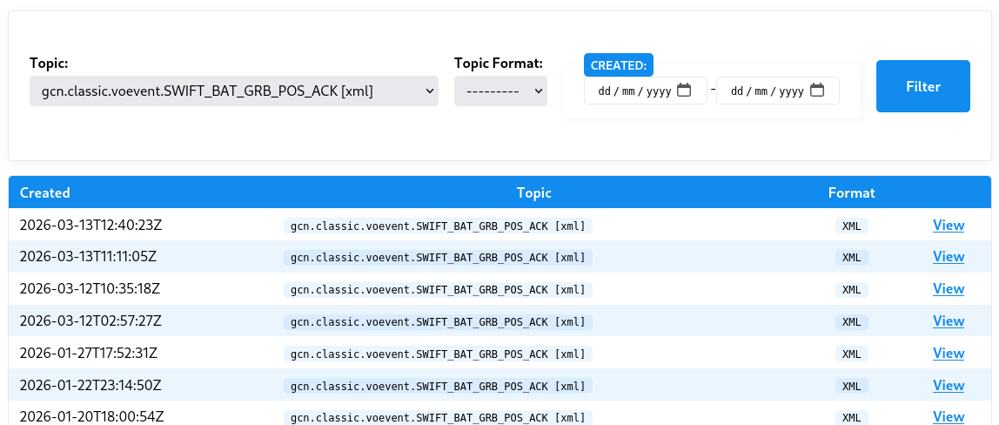

Now let's view one of these notices and inspect the associated payload.

For example:

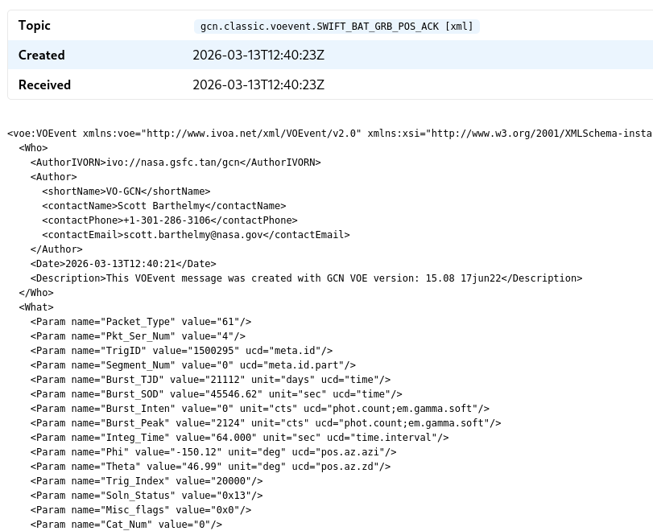

We see here the noice topic, the notice's annoucement time (as well the as time it was received by TRACE-T) and then the notice payload itself. This payload is in the XML format and includes some metadata such as the notice author, the notice date, and then information about the instrument and the event itself.

At this stage, we are interested in just two things that we will need when we first create the TRACE-T trigger:

* **Event ID:** A unique code that groups together notices that pertain to a single astronomical event
* **Event time:** The time the event occurred

Specifically, we need to be able to tell TRACE-T how to extract these values using either XPath (form XML payloads) or JSON-Path (for JSON payloads). [You will need to become comfortable with these expression languages.](index.html#xpath-and-jsonpath)

For SWIFT, notices are grouped together using an event ID known as the `TrigID`. Every SWIFT notice has this field and this allows us to know when disparate notices are referring to the same astronomical event.

Our aim is to extract this `TrigID` value, which we must do using XPath:

```
/voe:VOEvent/What/Param[@name="TrigID"]/@value
```

Further down in the XML, we can find the event time as `ISOTime`. Note that it's important to distinguish between the different times in the payload. In this case, we are not interested in the time the notice was created, we want the time of the event itself.

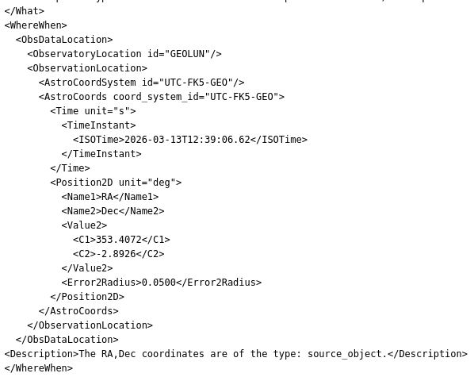


> **Now it's your turn:**
>
>  Try using XPath to extract the event time that is contained in the `ISOTime` XML node. (Hint: to access the node text you will need to use the `text()` function.)

<details>
    <summary>See the answer:</summary>

```
/voe:VOEvent/WhereWhen/ObsDataLocation/ObservationLocation/AstroCoords/Time/TimeInstant/ISOTime/text()
```

</details>

Finally, as a sanity check, ensure that the path to the event ID and event time is consistent across each of the notice types you are interested it. (This is a limitation of TRACE-T: you cannot have a single trigger that listens to notices from different observatories that have different notice structures.)

## Creating an empty trigger

Now that we understand where the event ID and time are located in the SWIFT notices, let's start by creating an empty trigger.

Go to `/triggers/create` and:

* Give it a descriptive name (e.g. "SWIFT GRBs")
* Select both `gcn.classic.voevent.SWIFT_BAT_GRB_POS_ACK` and `gcn.classic.voevent.SWIFT_XRT_POSITION` topics (by holding down the Control or Command buttons)
* Enter the event ID and time paths we identified earlier
* And set a reasonable expiry: this is how long after the event occurs that it is still useful for us to trigger a downstream observation. For the MWA, let's say that we care up to 24 hours (1440 minutes) after the event is first detected.

Altogether, our trigger configuration looks like this:

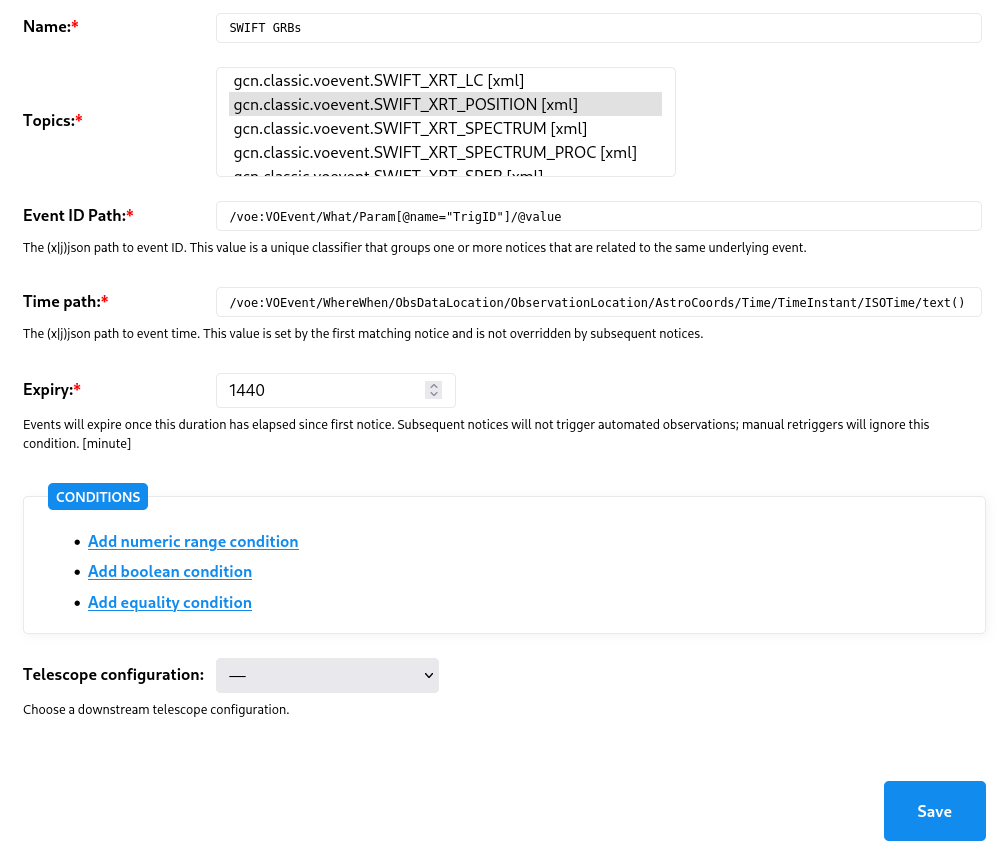

For now, ignore the conditions and ignore the telescope configuration. Click save.

## Exploring the event history

If the trigger saved successfully, you will be presented with the trigger summary page which consists of two parts:

1. A summary of the trigger configuration
2. A list of events extracted from your choice of subscribed topics

The events listing show us the history of events based on the archive of notices.

Crucially, it also shows, the `Current conditions` result. This result evaluates the current set of configured conditions and shows the (hypothetical) results. The result of each condition is depicted by a traffic light: green is PASS, orange is MAYBE, red is FAIL, and grey means an error occurred trying to evaluate the condition. We'll use these later when creating our conditions. **We are going to use this event history to validate and debug our trigger.**

> **Note:** The `Current conditions` field shows how the _current_ trigger conditions _would have_ behaved if they had existed at the time each archival notice was received. Each time you update a condition, these results will be updated, and this allows you to debug and validate your conditions. In contrast, `Decisions` reflects historical decisions made by TRACE-T. Since your trigger is brand new and probably hasn't been around long enough to have witnessed a new event, `Decisions` will be empty.

For now, if you hover over the single green traffic light for each notice you'll see a tooltip appear that describes the condition. As you'll see, this condition is the expiry time we set of 24 hours.

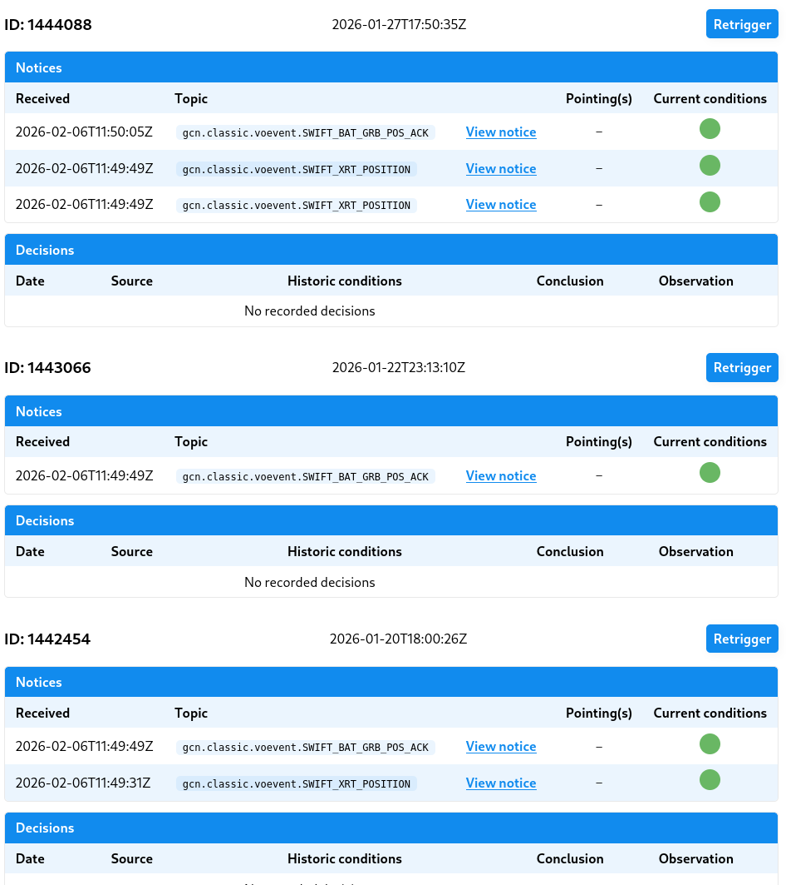

Click through the associated notices and get a sense for the kinds of information each notice contains.

## Adding some conditions

We want to add some conditions to our trigger. Specifically:

* We want to avoid observing within 5° of the equator, or having a Declination greater than +10°.
* The error radius must be less than 0.05° (and strictly greater than 0, which seems to indicate an error)
* We want an integration time of less than 2.048 seconds (for anything greater we will leave it to be manually overridden).
* We require SWIFT's starlock to be working correctly (otherwise the instrument might be reporting garbage coordinate values).

Let's start by adding the equatorial condition. Click "edit trigger" and then "Add numeric range condtion":

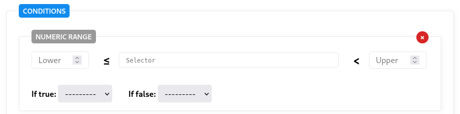

In the lower and upper fields, we can enter -5 and +5. The selector is the XPath to the declination value, which in this case is:

```
/voe:VEvent/WhereWhen/ObsDataLocation/ObservationLocation/AstroCoords/Position2D/Value2/C2/text()
```

Finally, if this condition is true we want to return a FAIL result. When complete, the configuration looks like this:

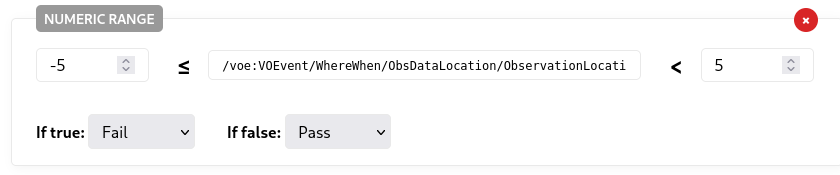

Click save and now inspect the event listing: you'll notice a second traffic light appears under the "Current conditions" that indicates this new equatorial declination condition.

For a trigger to be successful, every condition must return a PASS. A single FAIL result we caust the trigger overall to fail.

> **Now it's your turn:**
>
> Have a go adding numeric range conditions for the following:
> * The second declination requirement (Dec < 10°)
> * The error radius (0 < err < 0.05)
> * The integration time (`Integ_Time` > 2.048).
>
> You'll need to inspect the notices and construct the XPath selectors for each of these values.

We also require the starlock to be working. For this, we will use a boolean condition: we need `StarTrack_Lost_Lock` to be false.

When complete we have the following conditions:

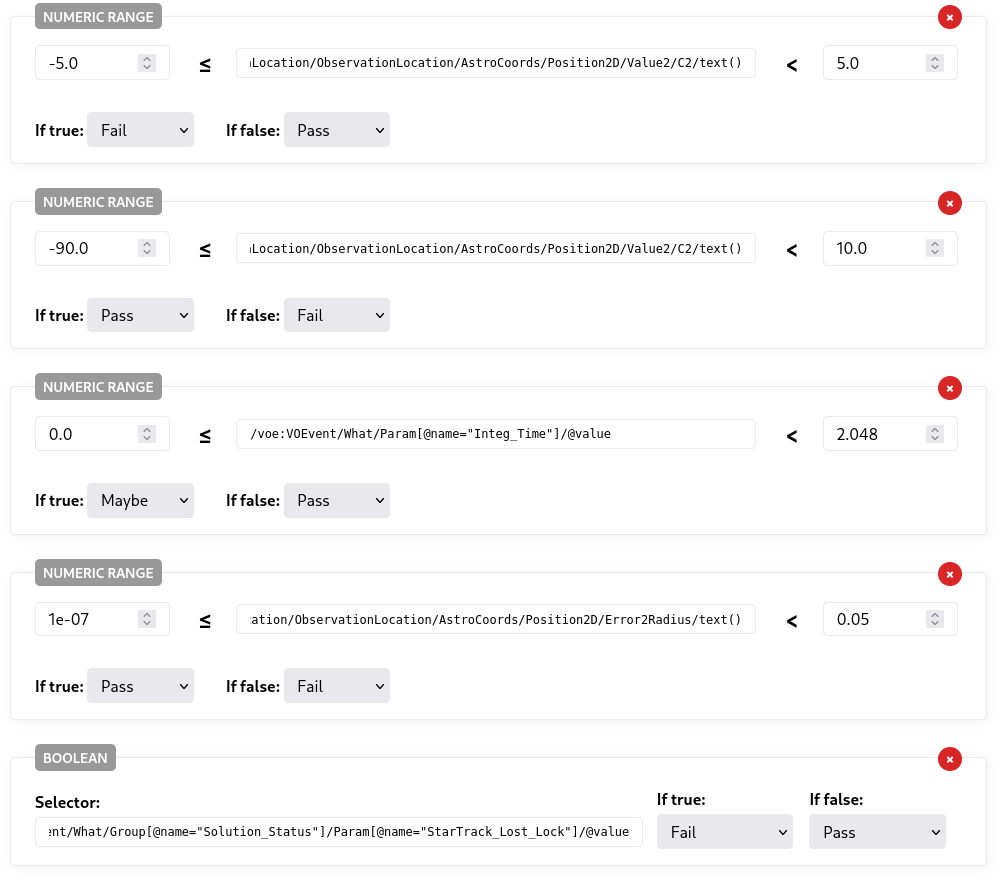

You may note that the integration time is set to MAYBE if false. MAYBE is a special value that is treated differently depending on what caused the trigger evaluation. In this case, if the integration time is less than 2.048, the MAYBE result allows for manual override. See [here](index.html#conditions) for more information.

Finally, save the trigger.

## Verifying the conditions

We can inspect each archive of events and verify whether our current set of conditions correctly captures the events we want  (and ignores the ones we don't).

Consider, for example, the following event:

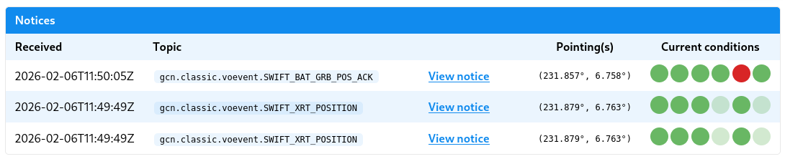

You can see that at the time of the first notice all conditions passed with the exception of one. Hovering over that particular traffic light we can see that this is the error radius condition: the first notice has an error radius that is too large.

By the second notice, however, the updated coordinates have an error radius that is sufficiently small. All lights are green and, if this had been active at the time, our trigger would have attempted an observation at this point.

> **Note:**
>
> What about the faded and washed out traffic lights? TRACE-T uses [condition inheritance](index.html#condition-inheritance). In this case both the integration time and star lock values are only given in the first notice and TRACE-T assumes that, in the absence of any other overriding values, these conditions remain satisfied. When a condition result is inherited from an earlier notice, TRACE-T depicts this using a faded traffic light value.

## Configuration the telescope

If you've verified that everything looks OK, it's time to finally add the configuration for the telescope. Click "edit trigger" and select your desired downstream telescope.

In this case we are going to use the MWA Correaltor with the following configuration:

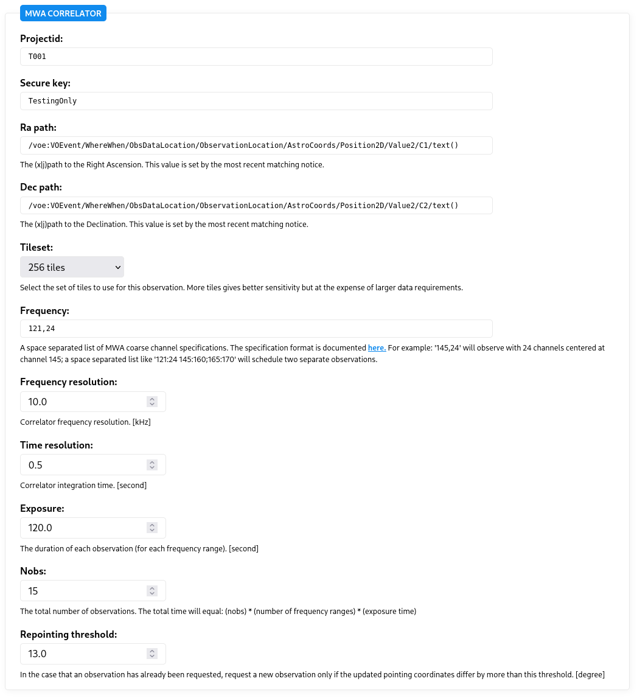

A lot of these configuration parameters are specific to the MWA with the exception of the RA and Dec paths: these are XPath selectors that extract the pointing coordinates. For most telescopes, you'll need to extract the RA and Dec values in the same fashion. (Some telescope configurations, however, may use probability sky maps, or default to a fly's eye observing mode.)

Save the trigger once more, and you'll note that back on the Trigger page, the events now have pointing coordinates based on the RA and Dec paths you provided.

## Manually triggering

In the normal course of events, a trigger is run each time a new notice arrives. Sometimes, however, you might want to manually intervene and force a trigger to be (re)evaluated for a specific event. This what the "Retrigger" button does above each event.

We can also manual retriggering to test our trigger. At the moment our trigger is still set to inactive and, when in this state, all communications with the downstream telescope, such as the MWA, will be marked as "testing" only.

First, find an event that your trigger currently passes on, and click "Retrigger". If the telescope is correctly configured, you should see a green observation button:

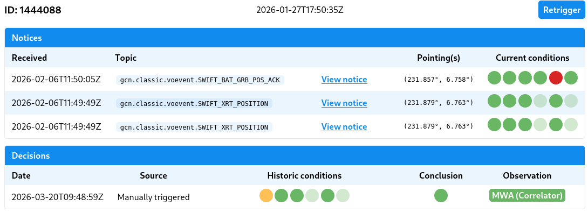

An orange or red observation button indicates a failure of some sort. In either case, you can click the button to inspect the observation details which includes the log. If an error occurred, the log can help you understand why.

## Setting your trigger as active

By now you've confirmed your trigger works against numerous archived events and confirmed it is successfully communicating with the downstream telescope. If you're ready, you can now ask a TRACE-T administrator to mark your trigger as active. The administrator will also assign your trigger a weight which determines its order amongst any other configured triggers: higher ranked triggers get priority when requesting an observation.
